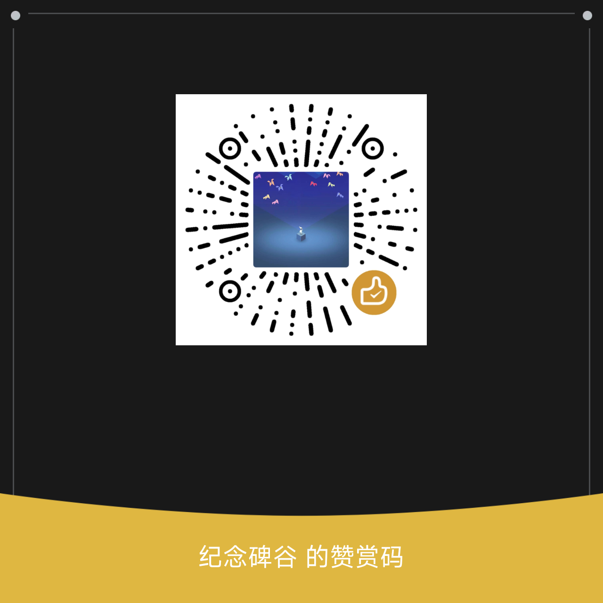

# 阿里云盘助手

> 阿里云盘 LSPosed 模块，解锁高清画质与倍速播放，并提供自动化签到能力。

## 主要功能

- 解锁高清画质与倍速播放
- 多账户签到
- 定时签到
- 远程推送
- 本地备份与恢复

## 使用要求

### 模块功能
1. 安装支持 **libxposed API 102** 的 Xposed 框架。
2. 在框架中激活本模块，并将「阿里云盘」勾选为作用域。
3. 重启阿里云盘后即可解锁高清画质与倍速播放。

### 签到功能
1. 通过多种方式（具体可自行检索）获取阿里云盘的 `refresh_token`。
2. 在应用「Token」页新建条目并填入。
3. 返回主页点击「运行签到」即可执行。

## 捐赠

如果这个项目对你有帮助，欢迎请作者喝杯咖啡 ☕

  
  

## 免责声明

本应用仅供学习、研究和技术交流使用，请勿用于任何商业或非法用途。

使用本模块可能影响目标应用与设备（如应用异常、账号风险、设备安全性降低等），由此产生的一切后果由使用者自行承担。

本软件按“原样”提供，作者不提供任何明示或暗示担保，亦不对因使用本软件导致的任何直接、间接损失（包括但不限于数据丢失、设备损坏、账号封禁）承担责任。

继续使用即表示您已知悉并同意上述条款，并承诺遵守所在地区法律法规及目标应用的服务条款。
